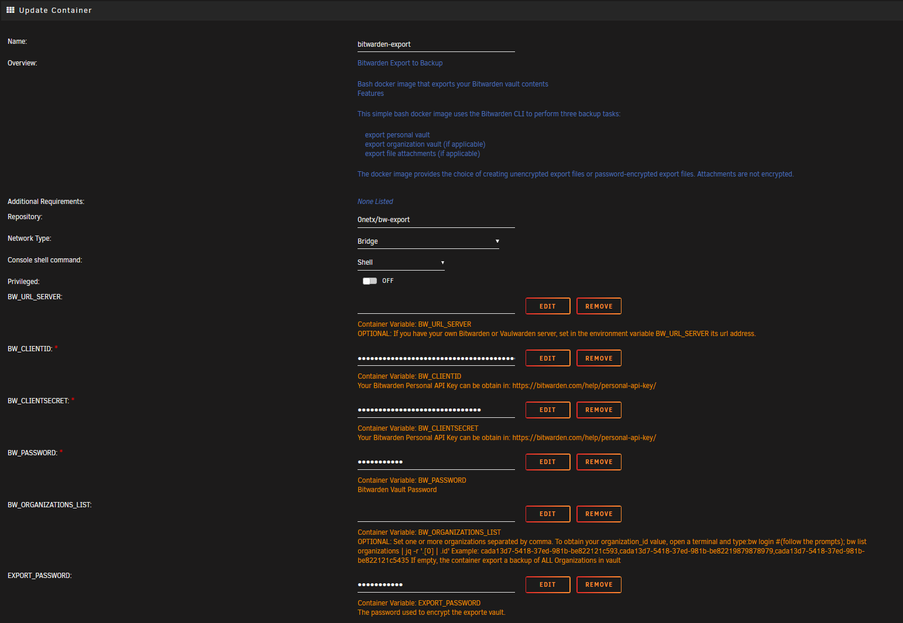
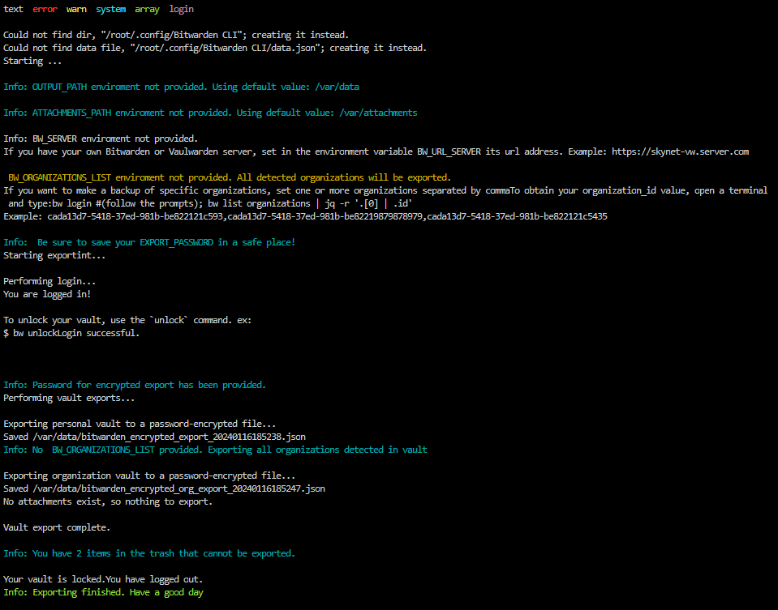

# Bitwarden_Export

**[Bitwarden_Export](https://github.com/0neTX/Bitwarden_Export)**: Bash docker image that exports your Bitwarden vault contents.

## Features

- [x] Export personal vault
- [x] Export all organizations in vault (if applicable)
- [x] Export file attachments (if applicable)

The docker image provides the choice of creating unencrypted export files or password-encrypted export files. Attachments are not encrypted.

## Running it

### Requirements

- [Docker](https://docker.com) (Obviously)
- Personal API Keys for CLI Authentication <a href="https://bitwarden.com/help/personal-api-key/" target="_blank">https://bitwarden.com/help/personal-api-key/</a>

### How install in Unraid

* Search `bw-export` in *Apps* top menu, select `Actions --> Install`
* Set the required enviroment variables.

### Configuration environment variables

You must report the following variables so that the container can authenticate itself in your vault. The API Keys for authentication can be obtained from Personal API Keys for CLI Authentication <a href="https://bitwarden.com/help/personal-api-key/" target="_blank">https://bitwarden.com/help/personal-api-key/</a>

- `BW_CLIENTID`:  It's `client_id` variable from your account
- `BW_CLIENTSECRET`:  It's `client_secret` variable from your account
- `BW_PASSWORD`:  Your Bitwarden/Vaultwarden password.
- `EXPORT_PASSWORD`:  Encryption password you have chosen for exporting then vault. if you choose to use password-encryption to store your export files (recommended) be sure that you use a strong and memorable password! (don't just store it inside Bitwarden, because if you get locked out of your account you won't be able to restore your exports)

**OPTIONALS VARIABLES:**

- `BW_ORGANIZATIONS_LIST`: If you want to make a backup of your organizations, set one or more organizations separated by comma. To obtain your organization_id value, open a terminal and type: `bw login #(follow the prompts); bw list organizations | jq -r '.[0] | .id'`. **If you don't provided any value, the container will export all organizations in your vault.**

**REQUIRED VOLUMENS:**

- `OUTPUT_PATH_VOLUME`: Mapping for exporting vault. Ussually: `/mnt/user/appdata/bw-export`
- `ATTACHMENTS_PATH_VOLUME`: Mapping for exporting attachments in vault. Ussually: `/mnt/user/appdata/bw-export`

Run the contaneir and check the logs. *No sensitive information is traced in logs.*

And enjoy it!

## Unraid Support Forum:
- [https://forums.unraid.net/topic/127999-support-onetx-template-support-thread/](https://forums.unraid.net/topic/127999-support-onetx-template-support-thread/)

## License

This project is licensed under the GPL 3.0 License. See the [LICENSE](..\LICENSE)
file for details.
