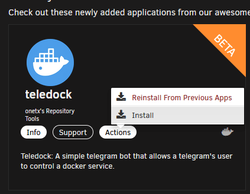
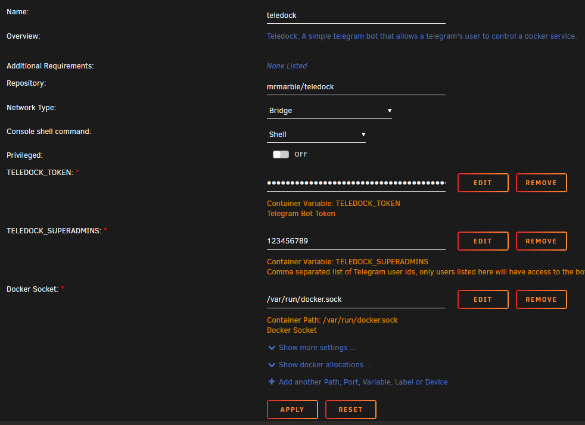

Hola a todos!

Acabo de publicar mi primera plantilla en Unraid.

# Teledock

**[Teledock](https://github.com/MrMarble/teledock)**: A simple telegram bot that allows a telegram's user to control a docker service.

## Features

- [x] List containers
- [x] Start / Stop containers
- [x] Inspect containers
- [x] List stacks
- [x] See logs
- [x] List images

## Running it

### Requirements

- [Docker](https://docker.com) (Obviously)
- Bot created in Telegram <a href="https://core.telegram.org/bots" target="_blank">https://core.telegram.org/bots</a>

### Configuration environment variables

- `TELEDOCK_TOKEN`: Telegram token. See <a href="https://core.telegram.org/bots" target="_blank">https://core.telegram.org/bots</a>
- `TELEDOCK_SUPERADMINS`: Comma separated list of Telegram user ids, only users listed here will have access to the bot.

### How install in Unraid

* Search `teledock` in *Apps* top menu, select `Actions --> Install`

* Set the required enviroment variables :

- `TELEDOCK_TOKEN`: Telegram token. See https://core.telegram.org/bots
- `TELEDOCK_SUPERADMINS`: Comma separated list of Telegram user ids, only users listed here will have access to the bot.

* Open the chat with your bot!

And enjoy it!

## License

This project is licensed under the GPL 3.0 License. See the [LICENSE](..\LICENSE)
file for details.
